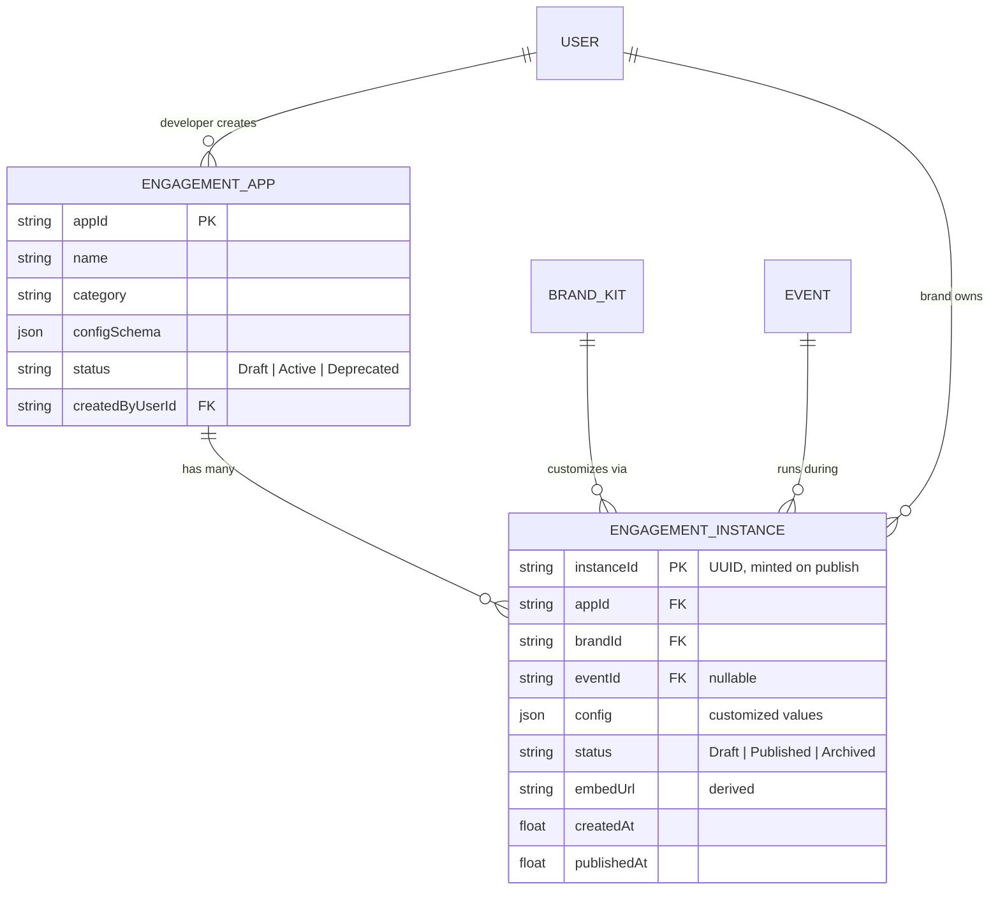
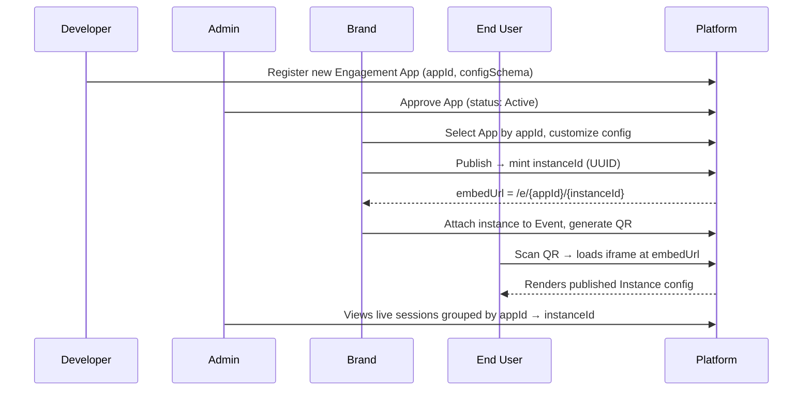

# Engagement App / Instance Architecture

Defines how engagements (games/activations) are built, customized, versioned, and
delivered to end users — and who is responsible for each stage.

## 1. Roles

| Role | Who | Responsibility |
|---|---|---|
| **Developer** | Internal engineering | Builds engagement runtimes (Selfie Wall, Memory Challenge, Lane Daze, etc.) and registers each one in the catalog under a stable **App ID**. Defines what's customizable (the config schema) for that App. |
| **Admin** | Platform / Super Admin | Sees every App ID and every Brand's customized Instances across the platform. Approves Apps for use, monitors live sessions, moderates content, manages Orgs/Events. |
| **Brand** | The customer | Picks an App from the catalog, customizes it (colors, logos, copy, rules, tiles), publishes it — each publish mints a new **Instance UUID**. Attaches an Instance to an Event and launches it. |
| **End User** | Fan / attendee | No login. Scans a QR code or opens a link that loads the published Instance inside an **iframe**. Never sees App IDs or UUIDs directly. |

This adds one role not currently in `src/constants/roles.js` (`AVAILABLE_ROLES`): **Developer**. Today that list has Super Admin, Brand, Marketing Agency, Event Organizer, Venue Manager.

## 2. Core Concepts

### App ID
A stable, human-readable identifier for an engagement **type** — set once by the Developer when the engagement is built, never changes.

```
selfie-wall
memory-challenge
live-poll
reaction-wall
lane-daze
```

This already exists in the codebase as `TemplateModel.id` (see `backend/routers/templates.py`). The Engagement Library *is* the App catalog — it just isn't called that yet.

### Instance (Engagement Version)
A specific Brand's customization of an App. Every time a Brand **publishes** changes, the system snapshots the config and mints a new **UUID**. The UUID is immutable and permanent — it's the historical record of "this exact configuration ran."

```
instanceId: 8f14e45f-ceea-467e-9c99-4f4e11f6d3a1
appId:      memory-challenge
brandId:    brand-cocacola
```

Draft edits update in place; publishing is the event that stamps a new UUID. This keeps Admin/analytics from drowning in a UUID per keystroke, while still giving every *launched* configuration a stable, citable identity.

> **Decided (Q1):** every publish mints a **new** UUID. Each published Instance is an immutable, permanent version — nothing is ever overwritten. Draft edits update in place (no UUID yet); each time the Brand clicks Publish, that snapshot is stamped with a fresh UUID and becomes a standalone historical record. Prior UUIDs keep resolving at their original embed URL even after the Brand publishes again.

### Embed (iframe delivery)
The published Instance is served at a public, unauthenticated URL. That URL is what goes into the QR code / Jumbotron link, and it's what gets embedded as an iframe wherever the engagement needs to run (fan mobile view, stadium display, or a third party's own site).

```
https://app.fanforge.io/e/{appId}/{instanceId}          → fan-facing (mobile) view
https://app.fanforge.io/e/{appId}/{instanceId}/display   → big-screen / Jumbotron view
```

The `appId` in the URL is redundant with the instance record but kept for readability and for Admin dashboards that filter "show me all live instances of `memory-challenge`."

## 3. Data Model



| Entity | Field | Notes |
|---|---|---|
| `ENGAGEMENT_APP` | `appId` | Stable slug, Developer-assigned, immutable |
| | `configSchema` | Declares what a Brand is allowed to customize (colors, tiles, copy, rules) |
| | `status` | Admin gates whether Brands can pick this App at all |
| `ENGAGEMENT_INSTANCE` | `instanceId` | UUID, minted on **publish**, immutable once created |
| | `config` | The actual customized values for this one instance |
| | `status` | `Draft` = editable, no UUID yet / editing existing UUID's pending changes; `Published` = live, immutable; `Archived` = retired |
| | `embedUrl` | `/e/{appId}/{instanceId}` — computed, not stored |

## 4. Mapping to the current codebase

| Concept here | Existing equivalent | Gap |
|---|---|---|
| Engagement App | `TemplateModel` / `/api/templates` | Already ID'd by slug; needs `configSchema` + Developer-only create/edit gating |
| Instance | `GameConfigModel` / `/api/game-config/{game_id}` | Currently **one config per App globally**, not per-Brand, not versioned. Needs `brand_id` + generated `instanceId` (UUID) + `status` (Draft/Published) |
| Brand customization UI | `BrandKitModel`, `BuilderContext`, `pages/builder/*` | Brand Kits are reusable presets (Coca-Cola, Pepsi, ...); an Instance layers *instance-specific* tweaks on top of a chosen Brand Kit, not a replacement for it |
| Embed delivery | `StadiumScreenRouter`, `/display`, `/selfie-wall/display`, etc. | Currently static routes per App, one active mode at a time (`screen_state.active_mode`). Needs to become instance-aware: `/e/:appId/:instanceId` and `/e/:appId/:instanceId/display` |
| Developer role | — | Not present in `AVAILABLE_ROLES`; needs adding with permissions like `apps.create`, `apps.publish_schema` |
| Admin visibility | `Dashboard.jsx`, `Analytics.jsx` | Needs an "Instances" view: group by App ID → list Instances per Brand → live status |

## 5. Lifecycle



## 6. Open questions

1. ~~**Publish semantics**~~ — **Resolved:** new UUID minted on every publish. `EngagementInstance` is a *version* table (one immutable row per publish), not a *deployment* table. Old UUIDs stay live indefinitely at their original embed URL; nothing is overwritten.
2. **Embed auth** — fully public URL, or a short-lived signed token per QR code to prevent link-sharing outside the event?
3. **Multiple concurrent instances** — can a Brand run two Instances of the same App at once for two different Events, or is it one active Instance per App per Brand?
4. **Rollback** — if a Brand publishes a bad config, do they revert to a prior `instanceId`, or edit-and-republish (new UUID)? *(Largely answered by Q1: rollback = point back at a prior UUID, since old versions are never deleted.)*
